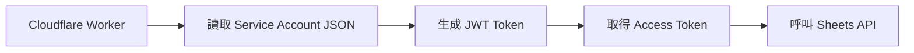
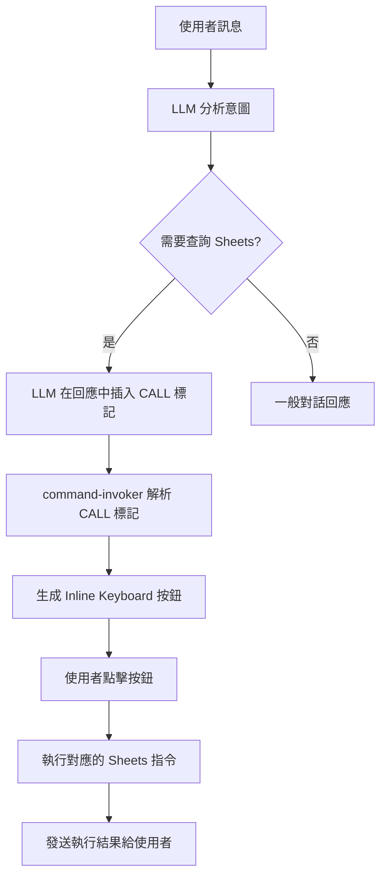

# Google Sheets 家庭管理系統整合計劃

 準備清單總結
您需要準備：
✅ Google Cloud Service Account JSON 金鑰（已下載）
✅ 收支表的 Spreadsheet ID（從 URL 取得）
✅ 行程表的 Spreadsheet ID（從 URL 取得）
✅ 將 Service Account email 加入兩個 Sheet 的共用權限（編輯者）
✅ 在行程表中建立「用戶對應表」tab（包含家庭成員資料）
✅ 家庭成員的 Telegram User ID（可從 bot 對話中取得）


## 目標

整合兩個 Google Sheets 表格到 Telegram Bot，透過 LLM 自然語言處理來查詢和管理：

1. **家庭收支表** - 查詢各項支出（玉山、星展、中信、國泰、台北富邦、工會、房租等）
2. **家庭行程表** - 建立和查詢家庭成員的行程安排

## 使用者需求回顧

根據您提供的圖片和需求：

- ✅ **白名單授權** - 只有 Telegram 白名單成員可以使用
- ✅ **LLM 自然語言** - 透過 LLM 理解使用者意圖並調用相應功能（**不使用明確指令**）
- ✅ **群組 @ 提醒** - 在群組中建立行程時 @ 當事人（支援 Telegram ID 和用戶名）
- ✅ **上下文感知回應** - 群組訊息在群組回應，私訊在私訊回應
- ✅ **完整 CRUD 操作** - 支援建立、查詢、修改、刪除行程
- ✅ **Bot 特定功能** - 只在 aws 和 chatgpt bot 啟用，gemini bot 不啟用

## 使用者需求確認

### 1. 收支表結構（已確認）

**讀取範圍**：僅讀取到 **J 欄位（房租）**，後面的 L、M 等欄位為使用者計算草稿，不需讀取。

**欄位定義**：
- **A 欄（月份）**：格式如 `2025/11`、`2024/12`
- **B 欄（總共）**：當月總支出
- **C 欄（玉山）**：玉山銀行信用卡支出
- **D 欄（星展）**：星展銀行信用卡支出
- **E 欄（中信）**：中信銀行信用卡支出
- **F 欄（國泰）**：國泰銀行信用卡支出
- **G 欄（台北富邦）**：台北富邦信用卡支出
- **H 欄（工會）**：工會費用
- **I 欄（現金）**：現金支出
- **J 欄（房租）**：房租支出

**LLM 查詢需求範例**：
- 「這三個月平均支出多少？」
- 「各銀行這幾個月信用卡支出多少錢？」
- 「11月國泰信用卡花了多少？」
- 「最近半年房租總共多少？」

**寫入需求範例**：
- 「寫入 12 月份國泰信用卡 7000 元」
- 「更新 2025/1 的玉山信用卡為 35000」

### 2. 行程表結構（新設計）

**欄位定義**：
| 欄位         | 說明         | 範例                         |
| ------------ | ------------ | ---------------------------- |
| A - 日期     | 行程日期     | `2025-01-15`                 |
| B - 時間     | 行程時間     | `14:30` 或 `下午3點`         |
| C - 對象     | 家庭成員姓名 | `小茹`、`小苑`               |
| D - 事件     | 事件簡述     | `拿包裹`、`看醫生`           |
| E - 內容     | 詳細說明     | `去 7-11 拿冷凍包裹`         |
| F - 建立時間 | 自動記錄     | `2025-01-14 10:30:00`        |
| G - 建立者   | Telegram ID  | `650289664`                  |
| H - 狀態     | 行程狀態     | `待處理`、`已完成`、`已取消` |

**行程唯一識別方式**：使用**複合鍵**（日期 + 對象 + 事件名稱）
```json
{
  "targetUser": "小茹",
  "date": "2025-01-15",
  "event": "拿包裹"
}
```

### 3. 用戶名稱對應表

**儲存位置**：存放在 **Google Sheets 的另一個 tab**（例如：「用戶對應表」）

**表格結構**：
| 真實姓名 | Telegram User ID | Telegram Username |
| -------- | ---------------- | ----------------- |
| 小茹     | 650289664        | xiaoru            |
| 小苑     | 280274865        | xiaoyuan          |

**讀取方式**：啟動時從 Google Sheets 讀取並快取到記憶體中

### 4. Google Sheets API 配額說明

根據 Google Sheets API 使用限制：
- **讀取請求**：每項專案每分鐘 300 次
- **寫入請求**：每項專案每分鐘 300 次
- **每位使用者每分鐘**：60 次

由於此功能僅供家庭成員使用（約 2-5 人），**不會達到 API 配額限制**，因此：
- ❌ **不需要實作快取機制（KV Cache）**
- ✅ 直接查詢 Google Sheets API
- ✅ 簡化架構，減少複雜度

> [!WARNING]
> ### 安全性考量
> 
> Google Service Account 的 JSON 金鑰包含敏感資訊，需要妥善保管：
> 
> - 建議使用 Cloudflare Workers Secrets 儲存
> - 不要將金鑰提交到 Git
> - 定期輪換金鑰

## 提議的架構設計

### 1. Google Sheets API 整合層

建立新模組 `src/features/google-sheets.js`：

```javascript
// Google Sheets API 封裝

// === 認證相關 ===
- authenticateGoogleSheets()
  // 使用 Service Account 認證（JWT Token 生成）
  // 在 Cloudflare Workers 環境中使用 Web Crypto API

// === 收支表操作 ===
- readBudgetSheet(range = 'A:J')
  // 讀取家庭收支表（僅讀取 A-J 欄）
  // 返回格式化的收支資料

- writeBudgetEntry(month, category, amount)
  // 寫入或更新特定月份的收支項目
  // 例：writeBudgetEntry('2025/12', '國泰', 7000)

- findBudgetRow(month)
  // 查找指定月份的行號
  // 用於更新現有資料

// === 行程表操作 ===
- readScheduleSheet()
  // 讀取家庭行程表（所有欄位 A-H）

- appendScheduleRow(schedule)
  // 新增行程到表格末端
  // 參數: { date, time, targetUser, event, content, createdBy, status }

- updateScheduleByKey(targetUser, date, event, updates)
  // 使用複合鍵更新行程
  // 先找到對應的行，再更新指定欄位

- deleteScheduleByKey(targetUser, date, event)
  // 使用複合鍵刪除行程

- querySchedules(filters)
  // 查詢符合條件的行程
  // filters: { targetUser?, dateFrom?, dateTo?, status? }

// === 用戶對應表操作 ===
- readUserMapping()
  // 從 Google Sheets 的「用戶對應表」tab 讀取
  // 快取到記憶體中（Worker 全域變數）
  // 返回格式: { "小茹": { userId: 123, username: "xiaoru" } }
```

### 2. Google Sheets 指令定義

在 `src/features/` 下擴展 `google-sheets.js`，新增 Telegram 指令處理器：

**重要**：使用現有的 `[CALL:...]` 機制，與現有指令系統一致（如 `/wt`、`/stock` 等）。

```javascript
// === 指令處理器（使用現有的 [CALL:...] 機制）===

/**
 * 查詢家庭收支
 * LLM 會輸出：[CALL:/budget 2025/11 國泰]
 * LLM 會輸出：[CALL:/budget 最近三個月 平均]
 */
export async function commandQueryBudget(message, command, subcommand, context) {
  try {
    // 解析參數
    const params = parsebudgetQueryParams(subcommand);

    // 讀取 Google Sheets
    const data = await readBudgetSheet();

    // 篩選和聚合
    const result = processBudgetQuery(data, params);

    // 格式化回應
    return sendMessageToTelegramWithContext(context)(formatBudgetResult(result));
  } catch (e) {
    return sendMessageToTelegramWithContext(context)(`查詢收支時發生錯誤：${e.message}`);
  }
}

/**
 * 寫入家庭收支
 * LLM 會輸出：[CALL:/budgetwrite 2025/12 國泰 7000]
 */
export async function commandWriteBudget(message, command, subcommand, context) {
  try {
    // 白名單檢查
    if (!isUserInWhitelist(context)) {
      return sendMessageToTelegramWithContext(context)('您沒有權限寫入收支資料');
    }

    // 解析參數：月份 類別 金額
    const [month, category, amount] = subcommand.split(' ');

    // 驗證參數
    if (!month || !category || !amount) {
      return sendMessageToTelegramWithContext(context)('參數格式錯誤，請使用：月份 類別 金額');
    }

    // 寫入 Google Sheets
    await writeBudgetEntry(month, category, parseInt(amount));

    return sendMessageToTelegramWithContext(context)(`✅ 已寫入：${month} ${category} ${amount} 元`);
  } catch (e) {
    return sendMessageToTelegramWithContext(context)(`寫入收支時發生錯誤：${e.message}`);
  }
}

/**
 * 查詢家庭行程
 * LLM 會輸出：[CALL:/schedule 小茹 今天]
 */
export async function commandQuerySchedule(message, command, subcommand, context) {
  try {
    const params = parseScheduleQueryParams(subcommand);
    const schedules = await querySchedules(params);

    if (schedules.length === 0) {
      return sendMessageToTelegramWithContext(context)('查無行程');
    }

    return sendMessageToTelegramWithContext(context)(formatScheduleList(schedules));
  } catch (e) {
    return sendMessageToTelegramWithContext(context)(`查詢行程時發生錯誤：${e.message}`);
  }
}

/**
 * 建立家庭行程
 * LLM 會輸出：[CALL:/scheduleadd 小茹 2025-01-15 14:30 拿包裹 去7-11拿冷凍包裹]
 */
export async function commandCreateSchedule(message, command, subcommand, context) {
  try {
    const schedule = parseScheduleParams(subcommand, context);
    await appendScheduleRow(schedule);

    // 格式化回應（群組中加 @ 提醒）
    const response = formatScheduleResponse(schedule, context);
    context.CURRENT_CHAT_CONTEXT.parse_mode = "Markdown";

    return sendMessageToTelegramWithContext(context)(response);
  } catch (e) {
    return sendMessageToTelegramWithContext(context)(`建立行程時發生錯誤：${e.message}`);
  }
}

/**
 * 修改家庭行程
 * LLM 會輸出：[CALL:/scheduleupdate 小茹 2025-01-15 拿包裹 time=15:30]
 */
export async function commandUpdateSchedule(message, command, subcommand, context) {
  try {
    const { targetUser, date, event, updates } = parseScheduleUpdateParams(subcommand);
    await updateScheduleByKey(targetUser, date, event, updates);

    return sendMessageToTelegramWithContext(context)(`✅ 已更新行程`);
  } catch (e) {
    return sendMessageToTelegramWithContext(context)(`修改行程時發生錯誤：${e.message}`);
  }
}

/**
 * 刪除家庭行程
 * LLM 會輸出：[CALL:/scheduledelete 小茹 2025-01-15 拿包裹]
 */
export async function commandDeleteSchedule(message, command, subcommand, context) {
  try {
    const { targetUser, date, event } = parseScheduleDeleteParams(subcommand);
    await deleteScheduleByKey(targetUser, date, event);

    return sendMessageToTelegramWithContext(context)(`✅ 已刪除行程`);
  } catch (e) {
    return sendMessageToTelegramWithContext(context)(`刪除行程時發生錯誤：${e.message}`);
  }
}
```

### 3. 環境變數與功能開關

在 `wrangler.toml` 中新增：

```toml
# 只在 aws 和 chatgpt 環境啟用
[env.aws.vars]
ENABLE_FAMILY_SHEETS = "true"

[env.chatgpt.vars]
ENABLE_FAMILY_SHEETS = "true"

# gemini 環境不啟用
[env.gemini.vars]
ENABLE_FAMILY_SHEETS = "false"  # 或不設定此變數
```

### 4. 上下文感知回應與 @ 提醒機制

修改回應邏輯以支援：
- 檢測訊息來源（群組 vs 私訊）
- 在群組中使用 @ 提醒（支援 Telegram ID 和用戶名）
- 在私訊中直接回應
- 智能解析真實姓名並轉換為 Telegram mention

## 提議的變更

### 新增檔案

#### [NEW] [google-sheets.js](file:///Users/david/git/tbdavid2019/Telegram-bot-cfWorkers/src/features/google-sheets.js)

Google Sheets API 整合模組，包含：
- Service Account 認證
- 讀取收支表資料
- 讀取/寫入行程表資料
- 資料格式化和解析

#### [NEW] [sheets-functions.js](file:///Users/david/git/tbdavid2019/Telegram-bot-cfWorkers/src/agent/sheets-functions.js)

LLM Function Calling 定義，包含：
- `queryBudget` - 查詢收支功能的 schema 和實作
- `querySchedule` - 查詢行程功能的 schema 和實作
- `createSchedule` - 建立行程功能的 schema 和實作
- `updateSchedule` - 修改行程功能的 schema 和實作
- `deleteSchedule` - 刪除行程功能的 schema 和實作

#### [NEW] [user-mapping.js](file:///Users/david/git/tbdavid2019/Telegram-bot-cfWorkers/src/utils/user-mapping.js)

用戶名稱對應工具，包含：
- 真實姓名 ↔ Telegram ID/用戶名的對應表
- `resolveUserMention()` - 將真實姓名轉換為 Telegram mention
- 支援群組成員查詢和快取

---

### 修改檔案

#### [MODIFY] [commands.js](src/telegram/commands.js)

註冊 Google Sheets 相關指令：
- 從 `google-sheets.js` 匯入指令處理器
- 在 `commandHandlers` 中註冊以下指令：
  - `/budget` - 查詢家庭收支
  - `/budgetwrite` - 寫入家庭收支
  - `/schedule` - 查詢家庭行程
  - `/scheduleadd` - 建立家庭行程
  - `/scheduleupdate` - 修改家庭行程
  - `/scheduledelete` - 刪除家庭行程
- 設定 `scopes` 和 `needAuth` 權限

#### [MODIFY] [command-discovery.js](src/agent/command-discovery.js)

加入 Google Sheets 指令說明到系統提示詞：
- 當 `ENABLE_FAMILY_SHEETS=true` 時，在可用指令列表中加入：
  - `/budget` - 查詢家庭收支（支援月份、類別、統計）
  - `/budgetwrite` - 寫入收支資料
  - `/schedule` - 查詢家庭行程
  - `/scheduleadd` - 建立新行程
  - `/scheduleupdate` - 修改行程
  - `/scheduledelete` - 刪除行程
- LLM 會根據使用者意圖輸出對應的 `[CALL:...]` 標記

#### [MODIFY] [wrangler.toml](file:///Users/david/git/tbdavid2019/Telegram-bot-cfWorkers/wrangler.toml)

新增環境變數（只在 aws 和 chatgpt 環境）：
- `ENABLE_FAMILY_SHEETS` - 功能開關（"true" 或 "false"）
- `GOOGLE_SHEETS_SERVICE_ACCOUNT` - Service Account JSON（Base64 編碼）
- `FAMILY_BUDGET_SHEET_ID` - 收支表 Spreadsheet ID
- `FAMILY_SCHEDULE_SHEET_ID` - 行程表 Spreadsheet ID
- `FAMILY_USER_MAPPING` - 用戶名稱對應表（JSON 格式）

---

## 驗證計劃

### 自動化測試

由於 Cloudflare Workers 環境的特殊性，我們將採用手動測試為主。

### 手動驗證步驟

#### 1. 收支查詢測試（私訊）

```
步驟：
1. 在私訊中向 Bot 發送：「查詢 2025/11 的家庭支出」
2. 預期：Bot 回應 11 月份各項支出明細

自然語言範例：
- "查詢 11 月的家庭支出"
- "玉山銀行最近三個月花了多少錢？"
- "上個月房租多少？"
```

#### 2. 收支查詢測試（群組）

```
步驟：
1. 在群組中 @ Bot 並發送：「@bot_name 查詢玉山銀行最近三個月的支出」
2. 預期：Bot 回應玉山銀行近三個月的支出統計

自然語言範例：
@bot_name 查詢玉山銀行最近三個月的支出
```

#### 3. 行程建立測試（私訊）

```
步驟：
1. 在私訊中發送：「幫我建立行程：明天下午 3 點，去 7-11 拿冷凍包裹」
2. 預期：
   - Bot 確認行程已建立
   - 在私訊中回應確認訊息
   - Google Sheets 中新增一筆記錄
```

#### 4. 行程建立測試（群組 + @ 提醒）

```
步驟：
1. 在群組中發送：「@bot_name 幫小茹建立行程：明天下午 6 點，去 7-11 拿冷凍包裹」
2. 預期：
   - Bot 在群組中回應並 @ 小茹（使用 Telegram ID 或用戶名）
   - 回應格式：「[@小茹](tg://user?id=123456) ⏰ 行程提醒（31 分鐘後）：...」
   - Google Sheets 中新增一筆記錄
```

#### 5. 行程修改測試

```
步驟：
1. 發送："把小茹明天下午 6 點的行程改成下午 7 點"
2. 預期：Bot 確認修改並更新 Google Sheets
```

#### 6. 行程刪除測試

```
步驟：
1. 發送："刪除小茹明天的 7-11 行程"
2. 預期：Bot 確認刪除並從 Google Sheets 移除
```

#### 7. 行程查詢測試

```
步驟：
1. 發送：「查詢小茹今天的行程」
2. 預期：Bot 列出小茹今天的所有行程
```

#### 8. 白名單授權測試

```
步驟：
1. 使用非白名單帳號發送：「查詢收支」
2. 預期：Bot 回應「您不在白名單中」或類似訊息
```

#### 9. Bot 功能開關測試

```
步驟：
1. 在 gemini bot 中發送："查詢家庭收支"
2. 預期：Bot 不會調用 Google Sheets，而是回應一般對話

3. 在 aws/chatgpt bot 中發送："查詢家庭收支"
4. 預期：Bot 正常調用 Google Sheets 並回應資料
```

### 驗證清單

- [ ] Google Service Account 認證成功
- [ ] 能正確讀取收支表資料
- [ ] 能正確讀取行程表資料
- [ ] 能新增行程到 Google Sheets
- [ ] 能修改 Google Sheets 中的行程
- [ ] 能刪除 Google Sheets 中的行程
- [ ] LLM 能正確理解收支查詢意圖
- [ ] LLM 能正確理解行程建立/修改/刪除意圖
- [ ] 私訊中的回應正確
- [ ] 群組中的回應正確且有 @ 提醒（支援 ID 和用戶名）
- [ ] 白名單授權機制正常運作
- [ ] 功能開關正常（aws/chatgpt 啟用，gemini 不啟用）
- [ ] 錯誤處理（如 API 失敗、表格不存在等）

---

## 實作順序

### Phase 0: 基礎建設與認證機制

**目標**：確保 Google Sheets API 認證在 Cloudflare Workers 環境中正常運作

1. **建立 Service Account 並取得 JSON 金鑰**
   - 在 Google Cloud Console 建立專案
   - 啟用 Google Sheets API
   - 建立 Service Account 並下載 JSON 金鑰
   - 將 Service Account 的 email 加入目標 Sheet 的共用權限

2. **實作 JWT Token 生成（使用 Web Crypto API）**
   - 在 `src/features/google-sheets.js` 實作 `authenticateGoogleSheets()`
   - 使用 Cloudflare Workers 的 `crypto.subtle` API
   - 生成 JWT Token 並換取 Access Token
   - 處理 Token 過期和自動更新

3. **測試基本連線**
   - 測試讀取收支表的第一行資料
   - 驗證權限設定正確
   - 確認錯誤處理機制

**關鍵技術挑戰**：
- Cloudflare Workers 不支援 Node.js 的 `crypto` 模組
- 需要使用 Web Crypto API 來簽署 JWT
- Service Account 的 private key 是 PKCS#8 格式，需要正確導入

---

### Phase 1: 收支表讀取與查詢功能

**目標**：實作收支查詢的核心功能，包含自然語言查詢

1. **實作收支表讀取**
   - `readBudgetSheet()` - 讀取 A-J 欄資料
   - 資料格式化與解析
   - 錯誤處理（如 Sheet 不存在、格式錯誤等）

2. **實作查詢邏輯**
   - 月份篩選
   - 類別篩選
   - 聚合計算（總和、平均）
   - 時間範圍解析（「最近三個月」→ 具體月份列表）

3. **整合 LLM Function Calling**
   - 在 `src/agent/sheets-functions.js` 實作 `queryBudget` function
   - 修改 `src/agent/llm.js`，將 `sheetsFunctionTools` 加入 tools 參數
   - 處理 LLM 的 tool_calls 回應
   - 執行查詢並格式化結果

4. **測試自然語言查詢**
   - 「這三個月平均支出多少？」
   - 「11月國泰信用卡花了多少？」
   - 「最近半年房租總共多少？」

**驗證標準**：
- ✅ LLM 能正確理解使用者查詢意圖
- ✅ 正確計算總和、平均值
- ✅ 回應格式清晰易讀

---

### Phase 2: 收支表寫入功能

**目標**：實作收支資料的新增與更新

1. **實作寫入邏輯**
   - `findBudgetRow(month)` - 查找指定月份的行號
   - `writeBudgetEntry(month, category, amount)` - 寫入或更新資料
   - 處理新月份（新增行）vs 現有月份（更新格）

2. **整合 LLM Function Calling**
   - 在 `sheets-functions.js` 實作 `writeBudget` function
   - 加入寫入權限檢查（確認使用者在白名單中）
   - 實作確認機制（避免誤寫）

3. **測試寫入操作**
   - 「寫入 12 月份國泰信用卡 7000 元」
   - 「更新 2025/1 的玉山信用卡為 35000」
   - 驗證 Google Sheets 中的資料正確性

**驗證標準**：
- ✅ 能正確識別月份並寫入對應的格子
- ✅ 不會覆蓋錯誤的資料
- ✅ 寫入後能立即查詢到新資料

---

### Phase 3: 用戶對應表與行程表讀取

**目標**：建立用戶對應機制，實作行程查詢功能

1. **建立用戶對應表（Google Sheets 新 tab）**
   - 在 Google Sheets 中建立「用戶對應表」tab
   - 欄位：真實姓名、Telegram User ID、Telegram Username
   - 填入家庭成員資料

2. **實作用戶對應表讀取**
   - `readUserMapping()` - 讀取對應表並快取到全域變數
   - 實作 `resolveUserMention(name)` - 將姓名轉為 Telegram mention
   - 處理找不到對應的情況

3. **實作行程表讀取**
   - `readScheduleSheet()` - 讀取行程表（A-H 欄）
   - `querySchedules(filters)` - 根據條件篩選行程

4. **整合 LLM Function Calling**
   - 在 `sheets-functions.js` 實作 `querySchedule` function
   - 測試各種查詢場景

**驗證標準**：
- ✅ 用戶對應表能正確讀取和快取
- ✅ 能根據日期、對象、狀態篩選行程
- ✅ 回應中正確顯示家庭成員姓名

---

### Phase 4: 行程表 CRUD 操作

**目標**：實作行程的建立、修改、刪除功能

1. **實作行程建立**
   - `appendScheduleRow(schedule)` - 新增行程到表格末端
   - 自動填入建立時間、建立者、預設狀態
   - 整合 `createSchedule` function

2. **實作行程修改**
   - `updateScheduleByKey(targetUser, date, event, updates)` - 使用複合鍵更新
   - 先查找對應的行，再更新指定欄位
   - 整合 `updateSchedule` function

3. **實作行程刪除**
   - `deleteScheduleByKey(targetUser, date, event)` - 使用複合鍵刪除
   - 整合 `deleteSchedule` function

4. **實作群組 @ 提醒機制**
   - 偵測訊息來源（群組 vs 私訊）
   - 在群組回應中加入 Markdown mention：`[@小茹](tg://user?id=123456)`
   - 確保使用正確的 `parse_mode`

**驗證標準**：
- ✅ 能成功建立、修改、刪除行程
- ✅ 複合鍵能正確識別唯一行程
- ✅ 群組中的 @ 提醒正常運作

---

### Phase 5: 整合測試與優化

**目標**：全功能測試並優化錯誤處理

1. **功能整合測試**
   - 在私訊中測試所有查詢、寫入功能
   - 在群組中測試行程建立與 @ 提醒
   - 跨功能測試（例如：查詢後寫入，再查詢驗證）

2. **白名單授權測試**
   - 使用非白名單帳號測試（應被拒絕）
   - 確認錯誤訊息友善

3. **功能開關測試**
   - 在 gemini bot 測試（應不啟用 Sheets 功能）
   - 在 aws/chatgpt bot 測試（應正常啟用）

4. **錯誤處理優化**
   - API 超時處理
   - 權限不足處理
   - 資料格式錯誤處理
   - 友善的錯誤訊息

5. **效能優化**
   - 檢查 API 請求次數
   - 優化查詢邏輯（減少不必要的讀取）

**驗證標準**：
- ✅ 所有驗證清單項目通過
- ✅ 錯誤處理完善
- ✅ 使用者體驗流暢

---

## 技術細節

### Google Sheets API 認證流程



### LLM 指令調用流程（使用現有 `[CALL:...]` 機制）



**實作說明**：
- 使用現有的 `[CALL:/command args]` 機制（與 `/wt`、`/stock` 等指令一致）
- LLM 在回應文字中插入 `[CALL:/budget 2025/11 國泰]`
- `command-invoker.js` 會解析這些標記並生成按鈕
- 使用者點擊按鈕後，執行對應的指令處理器
- **優點**：
  - ✅ 支援所有 LLM（OpenAI、Gemini、Xiaomi、Kimi 等）
  - ✅ 與現有指令系統一致
  - ✅ 實作簡單，維護成本低
  - ✅ 使用者可以選擇是否執行（按鈕確認）

### 群組 @ 提醒機制

在群組中建立行程時：
1. 解析目標使用者名稱（如「小茹」）
2. 從用戶對應表（Google Sheets tab）查找 Telegram ID 或用戶名
3. 優先使用 User ID：`[@小茹](tg://user?id=USER_ID)`
4. 備用方案使用用戶名：`@username`
5. 如果都找不到，使用純文字提及

**用戶對應表格式（Google Sheets tab）**：
| 真實姓名 | Telegram User ID | Telegram Username |
| -------- | ---------------- | ----------------- |
| 小茹     | 650289664        | xiaoru            |
| 小苑     | 280274865        | xiaoyuan          |

**實作注意事項**：
- 確保使用 `parse_mode: "Markdown"` 才能正確渲染 mention
- 在 Worker 啟動時讀取對應表並快取到全域變數
- 複合鍵識別行程時使用真實姓名（如「小茹」），不使用 Telegram ID

---

## 關鍵技術要點總結

### 1. Cloudflare Workers 環境限制

**不能使用**：
- ❌ Node.js `crypto` 模組
- ❌ Node.js `fs` 模組
- ❌ 傳統的 JWT 函式庫（如 `jsonwebtoken`）

**可以使用**：
- ✅ Web Crypto API (`crypto.subtle`)
- ✅ `fetch` API
- ✅ 全域變數（但每次 Worker 冷啟動會重置）

### 2. Google Sheets API 認證重點

**Service Account JWT 生成流程**：
```javascript
1. 解析 Service Account JSON 中的 private_key
2. 使用 Web Crypto API 導入 PKCS#8 格式的 private key
3. 生成 JWT header 和 payload
4. 使用 RS256 簽署 JWT
5. 用 JWT 換取 Access Token
6. 使用 Access Token 呼叫 Sheets API
```

**權限設定**：
- Service Account 的 email 必須加入目標 Sheet 的共用權限（編輯者）
- 在 Google Cloud Console 啟用 Google Sheets API

### 3. LLM 指令調用實作重點

**使用現有的 `[CALL:...]` 機制**：
- 與天氣查詢 `/wt`、股票查詢 `/stock` 等指令完全一致
- LLM 在回應文字中插入 `[CALL:/budget 2025/11 國泰]`
- `command-invoker.js` 自動解析並生成 Inline Keyboard 按鈕
- 使用者點擊按鈕後執行指令

**整合方式**：
1. 在 `src/features/google-sheets.js` 實作指令處理器
2. 在 `src/telegram/commands.js` 註冊指令到 `commandHandlers`
3. 在 `src/agent/command-discovery.js` 加入指令說明（當 `ENABLE_FAMILY_SHEETS=true`）
4. LLM 會在系統提示中看到這些指令，並在適當時機輸出 `[CALL:...]` 標記

**為何選擇此方案**：
- ✅ **LLM 兼容性**：支援所有 LLM（不限於支援 Function Calling 的模型）
- ✅ **一致性**：與現有指令系統完全一致，無需學習新機制
- ✅ **簡單性**：無需處理複雜的 `tool_calls` 迴圈
- ✅ **可靠性**：已在生產環境驗證的機制
- ✅ **使用者確認**：通過按鈕讓使用者確認操作（特別是寫入操作）

### 4. 資料結構設計重點

**收支表**：
- 僅讀取 A-J 欄（不含使用者的計算草稿欄位）
- 月份格式統一為 `2025/11`
- 支援查詢和寫入操作

**行程表**：
- 使用複合鍵（日期 + 對象 + 事件）識別唯一行程
- 不使用 UUID（避免增加欄位複雜度）
- 狀態欄位：待處理、已完成、已取消

**用戶對應表**：
- 存放在 Google Sheets 的獨立 tab
- 啟動時讀取並快取（不使用 KV）
- 用於將真實姓名轉為 Telegram mention

### 5. 錯誤處理策略

**必須處理的錯誤情境**：
- Google Sheets API 認證失敗（401）
- 權限不足（403）
- API 超時
- Sheet 不存在或格式錯誤
- 找不到對應的月份/行程
- 用戶不在白名單中

**錯誤訊息原則**：
- 對使用者友善（避免技術細節）
- 記錄詳細錯誤到 console（方便除錯）
- 提供可操作的建議（如「請確認月份格式」）

---

## 後續擴展可能性

- 📊 支援收支統計圖表生成（使用 Chart.js 或 Google Charts）
- 🔔 定時提醒即將到來的行程（使用 Cloudflare Cron Triggers）
- 📈 月度/年度收支報表自動生成
- 🎯 支援更多家庭成員的個人化設定
- 💾 支援資料匯出（CSV、Excel 格式）
- 🔍 進階查詢功能（如「比較今年和去年的支出」）
