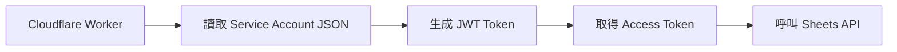
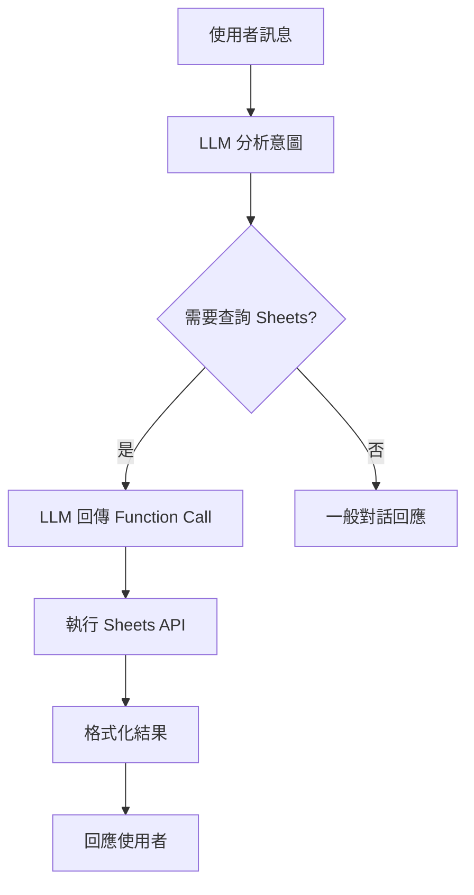

# Google Sheets 家庭管理系統整合計劃

## 目標

整合兩個 Google Sheets 表格到 Telegram Bot，透過 LLM 自然語言處理來查詢和管理：

1. **家庭收支表** - 查詢各項支出（玉山、星展、中信、國泰、台北富邦、工會、房租等）
2. **家庭行程表** - 建立和查詢家庭成員的行程安排

## 使用者需求回顧

根據您提供的圖片和需求：

- ✅ **白名單授權** - 只有 Telegram 白名單成員可以使用
- ✅ **LLM 自然語言** - 透過 LLM 理解使用者意圖並調用相應功能（**不使用明確指令**）
- ✅ **群組 @ 提醒** - 在群組中建立行程時 @ 當事人（支援 Telegram ID 和用戶名）
- ✅ **上下文感知回應** - 群組訊息在群組回應，私訊在私訊回應
- ✅ **完整 CRUD 操作** - 支援建立、查詢、修改、刪除行程
- ✅ **Bot 特定功能** - 只在 aws 和 chatgpt bot 啟用，gemini bot 不啟用

## 使用者審查需求

> [!IMPORTANT]
> ### Google Sheets 設定確認
> 
> 請確認以下資訊：
> 
> 1. **Google Sheets ID**
>    - 家庭收支表的 Spreadsheet ID（從 URL 中取得）
>    - 家庭行程表的 Spreadsheet ID
> 
> 2. **Google Service Account**
>    - 您是否已有 Google Service Account？
>    - 或者需要我提供設定指南？
> 
> 3. **表格結構**
>    - 收支表的欄位名稱（從圖片看到：月份、總共、玉山、星展、中信、國泰、台北富邦、工會、房租）
>    - 行程表的欄位名稱（需要您提供）
> 
> 4. **用戶名稱對應**
>    - 需要建立「真實姓名 ↔ Telegram ID/用戶名」的對應表
>    - 例如：小茹 → @xiaoru 或 User ID 123456

> [!WARNING]
> ### 安全性考量
> 
> Google Service Account 的 JSON 金鑰包含敏感資訊，需要妥善保管：
> 
> - 建議使用 Cloudflare Workers Secrets 儲存
> - 不要將金鑰提交到 Git
> - 定期輪換金鑰

## 提議的架構設計

### 1. Google Sheets API 整合層

建立新模組 `src/features/google-sheets.js`：

```javascript
// Google Sheets API 封裝
- authenticateGoogleSheets() - 使用 Service Account 認證
- readBudgetSheet() - 讀取家庭收支表
- readScheduleSheet() - 讀取家庭行程表
- appendScheduleRow() - 新增行程到表格
```

### 2. LLM Function Calling 定義

在 `src/agent/` 下新增 `sheets-functions.js`：

```javascript
// 定義給 LLM 的 Function Calling Schema
- queryBudget() - 查詢收支資料
  參數: { month?, category?, timeRange? }
  
- querySchedule() - 查詢行程
  參數: { targetUser?, timeRange?, question? }
  
- createSchedule() - 建立行程
  參數: { targetUser, date, time, event, content }
  
- updateSchedule() - 修改行程
  參數: { scheduleId, targetUser?, date?, time?, event?, content? }
  
- deleteSchedule() - 刪除行程
  參數: { scheduleId, targetUser?, date? }
```

### 3. 環境變數與功能開關

在 `wrangler.toml` 中新增：

```toml
# 只在 aws 和 chatgpt 環境啟用
[env.aws.vars]
ENABLE_FAMILY_SHEETS = "true"

[env.chatgpt.vars]
ENABLE_FAMILY_SHEETS = "true"

# gemini 環境不啟用
[env.gemini.vars]
ENABLE_FAMILY_SHEETS = "false"  # 或不設定此變數
```

### 4. 上下文感知回應與 @ 提醒機制

修改回應邏輯以支援：
- 檢測訊息來源（群組 vs 私訊）
- 在群組中使用 @ 提醒（支援 Telegram ID 和用戶名）
- 在私訊中直接回應
- 智能解析真實姓名並轉換為 Telegram mention

## 提議的變更

### 新增檔案

#### [NEW] [google-sheets.js](file:///Users/david/git/tbdavid2019/Telegram-bot-cfWorkers/src/features/google-sheets.js)

Google Sheets API 整合模組，包含：
- Service Account 認證
- 讀取收支表資料
- 讀取/寫入行程表資料
- 資料格式化和解析

#### [NEW] [sheets-functions.js](file:///Users/david/git/tbdavid2019/Telegram-bot-cfWorkers/src/agent/sheets-functions.js)

LLM Function Calling 定義，包含：
- `queryBudget` - 查詢收支功能的 schema 和實作
- `querySchedule` - 查詢行程功能的 schema 和實作
- `createSchedule` - 建立行程功能的 schema 和實作
- `updateSchedule` - 修改行程功能的 schema 和實作
- `deleteSchedule` - 刪除行程功能的 schema 和實作

#### [NEW] [user-mapping.js](file:///Users/david/git/tbdavid2019/Telegram-bot-cfWorkers/src/utils/user-mapping.js)

用戶名稱對應工具，包含：
- 真實姓名 ↔ Telegram ID/用戶名的對應表
- `resolveUserMention()` - 將真實姓名轉換為 Telegram mention
- 支援群組成員查詢和快取

---

### 修改檔案

#### [MODIFY] [command-discovery.js](file:///Users/david/git/tbdavid2019/Telegram-bot-cfWorkers/src/agent/command-discovery.js)

**不新增明確指令**，而是在系統提示詞中加入功能說明：
- 當 `ENABLE_FAMILY_SHEETS=true` 時，在 LLM 系統提示中加入家庭收支和行程管理的說明
- LLM 會自動理解使用者意圖並調用對應的 function

#### [MODIFY] [llm.js](file:///Users/david/git/tbdavid2019/Telegram-bot-cfWorkers/src/agent/llm.js)

整合 Google Sheets Function Calling：
- 將 sheets-functions 加入 LLM 的 tools 列表
- 處理 LLM 回傳的 function call
- 執行對應的 Google Sheets 操作

#### [MODIFY] [wrangler.toml](file:///Users/david/git/tbdavid2019/Telegram-bot-cfWorkers/wrangler.toml)

新增環境變數（只在 aws 和 chatgpt 環境）：
- `ENABLE_FAMILY_SHEETS` - 功能開關（"true" 或 "false"）
- `GOOGLE_SHEETS_SERVICE_ACCOUNT` - Service Account JSON（Base64 編碼）
- `FAMILY_BUDGET_SHEET_ID` - 收支表 Spreadsheet ID
- `FAMILY_SCHEDULE_SHEET_ID` - 行程表 Spreadsheet ID
- `FAMILY_USER_MAPPING` - 用戶名稱對應表（JSON 格式）

---

## 驗證計劃

### 自動化測試

由於 Cloudflare Workers 環境的特殊性，我們將採用手動測試為主。

### 手動驗證步驟

#### 1. 收支查詢測試（私訊）

```
步驟：
1. 在私訊中向 Bot 發送：「查詢 2025/11 的家庭支出」
2. 預期：Bot 回應 11 月份各項支出明細

自然語言範例：
- "查詢 11 月的家庭支出"
- "玉山銀行最近三個月花了多少錢？"
- "上個月房租多少？"
```

#### 2. 收支查詢測試（群組）

```
步驟：
1. 在群組中 @ Bot 並發送：「@bot_name 查詢玉山銀行最近三個月的支出」
2. 預期：Bot 回應玉山銀行近三個月的支出統計

自然語言範例：
@bot_name 查詢玉山銀行最近三個月的支出
```

#### 3. 行程建立測試（私訊）

```
步驟：
1. 在私訊中發送：「幫我建立行程：明天下午 3 點，去 7-11 拿冷凍包裹」
2. 預期：
   - Bot 確認行程已建立
   - 在私訊中回應確認訊息
   - Google Sheets 中新增一筆記錄
```

#### 4. 行程建立測試（群組 + @ 提醒）

```
步驟：
1. 在群組中發送：「@bot_name 幫小茹建立行程：明天下午 6 點，去 7-11 拿冷凍包裹」
2. 預期：
   - Bot 在群組中回應並 @ 小茹（使用 Telegram ID 或用戶名）
   - 回應格式：「[@小茹](tg://user?id=123456) ⏰ 行程提醒（31 分鐘後）：...」
   - Google Sheets 中新增一筆記錄
```

#### 5. 行程修改測試

```
步驟：
1. 發送："把小茹明天下午 6 點的行程改成下午 7 點"
2. 預期：Bot 確認修改並更新 Google Sheets
```

#### 6. 行程刪除測試

```
步驟：
1. 發送："刪除小茹明天的 7-11 行程"
2. 預期：Bot 確認刪除並從 Google Sheets 移除
```

#### 7. 行程查詢測試

```
步驟：
1. 發送：「查詢小茹今天的行程」
2. 預期：Bot 列出小茹今天的所有行程
```

#### 8. 白名單授權測試

```
步驟：
1. 使用非白名單帳號發送：「查詢收支」
2. 預期：Bot 回應「您不在白名單中」或類似訊息
```

#### 9. Bot 功能開關測試

```
步驟：
1. 在 gemini bot 中發送："查詢家庭收支"
2. 預期：Bot 不會調用 Google Sheets，而是回應一般對話

3. 在 aws/chatgpt bot 中發送："查詢家庭收支"
4. 預期：Bot 正常調用 Google Sheets 並回應資料
```

### 驗證清單

- [ ] Google Service Account 認證成功
- [ ] 能正確讀取收支表資料
- [ ] 能正確讀取行程表資料
- [ ] 能新增行程到 Google Sheets
- [ ] 能修改 Google Sheets 中的行程
- [ ] 能刪除 Google Sheets 中的行程
- [ ] LLM 能正確理解收支查詢意圖
- [ ] LLM 能正確理解行程建立/修改/刪除意圖
- [ ] 私訊中的回應正確
- [ ] 群組中的回應正確且有 @ 提醒（支援 ID 和用戶名）
- [ ] 白名單授權機制正常運作
- [ ] 功能開關正常（aws/chatgpt 啟用，gemini 不啟用）
- [ ] 錯誤處理（如 API 失敗、表格不存在等）

---

## 實作順序

1. **Phase 1: Google Sheets API 整合**
   - 設定 Service Account
   - 實作基本的讀取功能
   - 測試連線和資料讀取

2. **Phase 2: 收支查詢功能**
   - 實作 LLM Function Calling for budget queries
   - 整合到系統提示詞（不使用明確指令）
   - 測試各種自然語言查詢場景

3. **Phase 3: 行程管理功能**
   - 實作 LLM Function Calling for schedule CRUD
   - 實作用戶名稱對應和 @ 提醒機制
   - 支援建立、查詢、修改、刪除行程

4. **Phase 4: 整合測試**
   - 在私訊和群組中測試所有功能
   - 驗證白名單授權
   - 優化錯誤處理

---

## 技術細節

### Google Sheets API 認證流程



### LLM Function Calling 流程



### 群組 @ 提醒機制

在群組中建立行程時：
1. 解析目標使用者名稱（如「小茹」）
2. 從用戶對應表查找 Telegram ID 或用戶名
3. 優先使用 User ID：`[@小茹](tg://user?id=USER_ID)`
4. 備用方案使用用戶名：`@username`
5. 如果都找不到，使用純文字提及

**用戶對應表範例**：
```json
{
  "小茹": { "userId": 123456, "username": "xiaoru" },
  "小苑": { "userId": 789012, "username": "xiaoyuan" }
}
```

---

## 後續擴展可能性

- 📊 支援收支統計圖表生成
- 🔔 定時提醒即將到來的行程
- 📝 支援行程修改和刪除
- 🎯 支援多個家庭成員的個人化設定
- 📈 月度/年度收支報表自動生成
